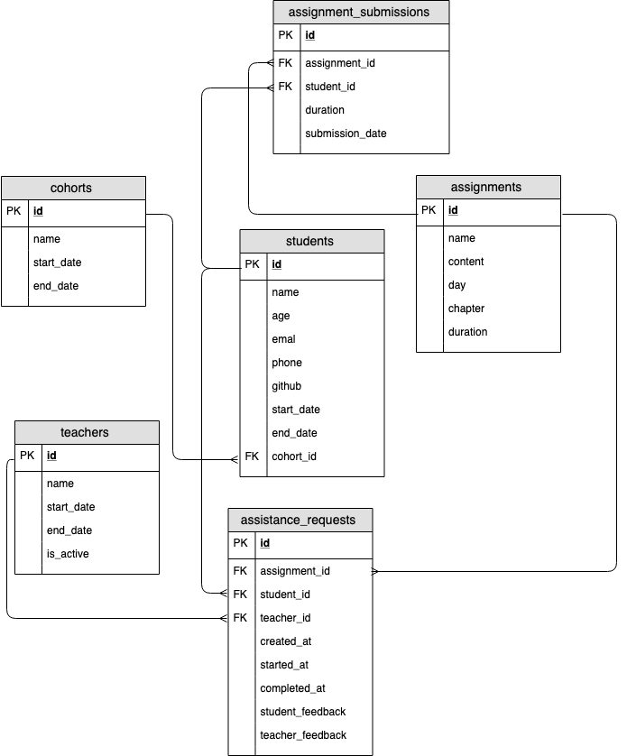

# BootcampX
A set of database queries for a [Light House Labs](https://github.com/lighthouse-labs) application to help manage data about students and mentors.

# Creating database
* [_`students`_](migrations/students_cohorts.sql)
  ```bash
     id | name | email | phone | github | start_date | end_date | cohort_id
    ----+------+-------+-------+--------+------------+----------+-----------
  ```
  - `id`: A unique identifier
  - `name`: The full name of the student
  - `email`: The students' email address
  - `phone`: The students' phone number
  - `github`: The students' github profile url
  - `start_date`: The students' start date of the Bootcamp
  - `end_date`: The students' end date of the Bootcamp
  - `cohort_id`: The id of the cohort that the student is enrolled in

* [_`cohorts`_](migrations/students_cohorts.sql)
  ```bash
   id | name | start_date | end_date
  ----+------+------------+----------
  ```
  - `id`: A unique identifier
  - `name`: The name of the cohort
  - `start_date`: The cohorts' start date
  - `end_date`: The cohorts' end date

* [_`assignments`_](migrations/assignments_submissions.sql)
  ```bash
   id | name | content | day | chapter | duration
  ----+------+---------+-----+---------+----------
  ```
  - `id`: A unique identifier
  - `name`: The name of the assignment
  - `content`: The written content body of the assignment
  - `day`: The day that the assignment appears on
  - `chapter`: The order that the assignment will appear in the day.
  - `duration`: The average time it takes a student to finish

* [_`assignment_submissions`_](migrations/assignments_submissions.sql)
  ```bash
   id | assignment_id | student_id | duration | submission_date
  ----+---------------+------------+----------+-----------------
  ```
  - `id`: A unique identifier
  - `assignment_id`: The id of the assignment
  - `student_id`: The id of the student
  - `duration`: The time it took the student to complete the assignment
  - `submission_date`: The date is was submitted

* [_`teachers`_](migrations/teachers_assistance_requests.sql)
  ```bash
   id | name | is_active | start_date | end_date
  ----+------+-----------+------------+----------
  ```
  - `id`: A unique identifier
  - `name`: The name of the teacher
  - `start_date`: The date that the teacher started working.
  - `end_date`: The date that the teacher stopped working.
  - `is_active`: If the teacher is actively teaching right now.

* [_`assistance_requests`_](migrations/teachers_assistance_requests.sql)
  ```bash
   id | student_id | teacher_id | assignment_id | created_at | started_at | completed_at | student_feedback | teacher_feedback
  ----+------------+------------+---------------+------------+------------+--------------+------------------+------------------
  ```
  - `id`: A unique identifier
  - `assignment_id`: The id of the assignment the request was made from
  - `student_id`: The id of the student making the request
  - `teacher_id`: The id of the teacher responding to the request
  - `created_at`: The timestamp when the request was made
  - `started_at`: The timestamp when the assistance started
  - `completed_at`: The timestamp when the assistance was completed
  - `student_feedback`: Feedback about the student given by the teacher
  - `teacher_feedback`: Feedback about the teacher given by the student



Temporary fake data
```bash
wget http://bit.ly/2xuYlJX -O seeds/students.sql
wget http://bit.ly/2JsdAZB -O seeds/cohorts.sql
wget http://bit.ly/2xsHpnr -O seeds/assignment_seeds.sql
wget http://bit.ly/2KVhygR -O seeds/assignment_submissions_seeds.sql
wget http://bit.ly/2XPT12w -O teacher_seeds.sql
wget http://bit.ly/30bIUma -O assistance_requests_seeds.sql
```

```sql
CREATE DATABASE bootcampx;
\c bootcampx;

);

\i migrations/students_cohorts.sql
\i migrations/assignments_submissions.sql

\i seeds/cohorts.sql
\i seeds/students.sql
\i seeds/assignment_seeds.sql
\i seeds/assignment_submissions_seeds.sql

```

# Queries
## [1_students_without_github.sql](queries/1_students_without_github.sql)
Selects `id`, `name`, `email`, and `cohort_id` of those without a github account
```bash
 id  |       name        |             email              | cohort_id
-----+-------------------+--------------------------------+-----------
  99 | Herminia Smitham  | sawayn.sarina@yahoo.com        |         7
 102 | Jacinthe Kautzer  | litzy_fay@hilpert.net          |         7
 111 | Bernardo Turcotte | margarita.anderson@paolo.name  |         8
 123 | Eloisa Quigley    | schmidt.ansel@gmail.com        |         9
 128 | Tiana Altenwerth  | zelda.stanton@yahoo.com        |         9
 ...
```
## [students_in_cohort.sql](queries/students_in_cohort.sql)
Selects `id` and `name` of students in cohort `cohort_id = 1`, and orders them in alphabetical order.
```bash
 id |       name
----+-------------------
  1 | Armand Hilll
 13 | Brian Jones
 16 | Carmel Grant
 14 | Clint Cremin
 17 | Colten Gutkowski
  9 | Donnie Lueilwitz
  ...
```
## [total_students_in_cohort.sql](queries/total_students_in_cohort.sql)
Selects the total number of students who were in the first 3 cohorts.

```bash
 Total
-------
    48
(1 row)
```

## [students_without_contact_details.sql](queries/students_without_contact_details.sql)
Gets the `name`, `id`, and `cohort_id` of all of the students that don't have an email or a phone number.
```bash
       name       | id  | cohort_id
------------------+-----+-----------
 Aurore Yundt     | 160 |        11
 Cory Toy         | 161 |        11
 Kurt Turcotte    | 163 |        11
 Elda McClure     | 164 |        11
 Luisa Sipes      | 168 |        11
 Bertha Johnson   | 172 |        11
 ...
```
## [students_without_gmail_or_phone.sql](queries/students_without_gmail_or_phone.sql)
Gets the `name`, `email`, `id`, and `cohort_id` of all of the students without a gmail.com and phone number.

```bash
      name       |           email           | id  | cohort_id
-----------------+---------------------------+-----+-----------
 Javonte Ward    | jessie_howell@hotmail.com | 178 |
 Jessika Jenkins | stephanie.koss@kevon.io   | 187 |
 Jerrold Rohan   | wehner.twila@hotmail.com  | 189 |
(3 rows)
```

## [currently_enrolled_students.sql](queries/currently_enrolled_students.sql)
Gets the `name`, `id`, and `cohort_id` of all of the students currently enrolled and orders them by `cohort_id`.

```bash
        name         | id  | cohort_id
---------------------+-----+-----------
 Deon Hahn           | 151 |        11
 Sean Bartell        | 152 |        11
 Sarai Flatley       | 153 |        11
 Billie Mitchell     | 154 |        11
 Vance Kihn          | 155 |        11
 ...
 (42 rows)
 ```


## [students_without_github.sql](queries/students_without_github.sql)
Gets the `name`, `email`, and `phone` number of all _graduates_ without a linked Github account.

```bash
       name        |             email             |    phone
-------------------+-------------------------------+--------------
 Herminia Smitham  | sawayn.sarina@yahoo.com       | 778-251-5094
 Jacinthe Kautzer  | litzy_fay@hilpert.net         | 075-883-5570
 Bernardo Turcotte | margarita.anderson@paolo.name | 814-473-6929
 Eloisa Quigley    | schmidt.ansel@gmail.com       | 276-965-2022
 Tiana Altenwerth  | zelda.stanton@yahoo.com       | 448-872-0954
 Hailie Kutch      | zora.corkery@goldner.net      | 249-763-9998
(6 rows)
```
## [total_time_spent_on_all_assignments.sql](queries/total_time_spent_on_all_assignments.sql)
Gets the total amount of time that a student has spent on all assignments, in this case _'Ibrahim Schimmel'_.

```bash
       name       | total_duration
------------------+----------------
 Ibrahim Schimmel |           6888
(1 row)
```
## [cohorts_total_assignment_duration.sql](queries/cohorts_total_assignment_duration.sql)
Gets the total amount of time that all students from a specific cohort have spent on all assignments, in this case _'FEB12'_.

```bash
 cohort | total_duration
--------+----------------
 FEB12  |         373501
(1 row)
```
## [total_number_of_assignment_for_each_day_of_bootcamp.sql](queries/total_number_of_assignment_for_each_day_of_bootcamp.sql)

Gets the total number of assignments for each day of bootcamp, ordered and grouped by the day.

```bash
 day | total_assignments
-----+-------------------
   1 |                11
   2 |                 9
   3 |                 9
   4 |                 9
   ...
   (51 rows)
```
## [total_number_of_assignment_for_busy_days.sql](queries/total_number_of_assignment_for_busy_days.sql)
Gets the total number of assignments for busy days with more than 9 assignments, ordered and grouped by the day.

```bash
 day | total_assignments
-----+-------------------
   1 |                11
   9 |                12
  22 |                10
  23 |                10
  24 |                10
  29 |                10
```
## [large_cohorts.sql](queries/large_cohorts.sql)
Gets all the cohorts with 18 or more students, ordered by size
```bash
 name  | student_count
-------+---------------
 FEB12 |            18
 APR09 |            19
 JUN04 |            19
 NOV19 |            22
 SEP24 |            22
(5 rows)
```
## [total_assignment_submissions_per_cohorts.sql](queries/total_assignment_submissions_per_cohorts.sql)
Gets the total number of assignment submissions for each cohort, ordered from greatest to least submissions.

```bash
 cohort | total_submissions
--------+-------------------
 SEP24  |              9328
 JUN04  |              8030
 APR09  |              7935
 NOV19  |              7231
 JUL02  |              5868
 MAY07  |              5843
 FEB12  |              5440
 JUL30  |              4664
 OCT22  |              4626
 AUG27  |              4589
 MAR12  |              3002
(11 rows)
```

## [average_completion_time_of_current_cohort.sql](queries/average_completion_time_of_current_cohort.sql)
Gets the average assignment completion time of the currently enrolled students, ordered the results from greatest duration to least.

```bash
       student       | average_assignment_duration 
---------------------+-----------------------------
 Hettie Hettinger    |        140.0533333333333333
 Santino Oberbrunner |        139.2991803278688525
 Vance Kihn          |        100.0730994152046784
 Jerrold Rohan       |         99.3553719008264463
 Vivienne Larson     |         96.1818181818181818
 ...
(42 rows)
```

## [low_average_completion_time.sql](queries/low_average_completion_time.sql)
Gets the students, from current cohort, who's average time it takes to complete an assignment is less than the average estimated time it takes to complete an assignment. Ordered from smallest to largest time.

```bash
    student     | average_assignment_duration | average_estimated_duration
----------------+-----------------------------+----------------------------
 Delores Gibson |         41.2971428571428571 |        53.7571428571428571
 Cory Toy       |         41.8800000000000000 |        53.7571428571428571
 Nola Jerde     |         42.2764227642276423 |        54.3089430894308943
 Florida Turner |         42.5934959349593496 |        54.3089430894308943
(4 rows)
```
## [total_teacher_assistance_requests_for.sql](queries/total_teacher_assistance_requests_for.sql)
Gets the total number of assistance_requests for a given teacher, in this case _'Waylon Boehm'_.

```bash
     name     | total_assistances
--------------+-------------------
 Waylon Boehm |              4227
(1 row)
```

## [total_assistance_requests_for.sql](queries/total_assistance_requests_for.sql)
Gets the total number of assistance_requests for a given student, in this case _'Elliot Dickinson'_.
```bash
       name       | total_assistances
------------------+-------------------
 Elliot Dickinson |               138
(1 row)
```

## [assistance_requests_data.sql](queries/assistance_requests_data.sql)
Gets important data about each assistance request for a named-assignment, with the following columns:
  - teacher's name
  - student's name
  - assignment's name
  - _duration_ for each assistance request
    - Calculated as the difference between `completed_at` and `started_at`.
Ordered by _duration_
```bash
      teacher       |         student          |             assignment             | duration
--------------------+--------------------------+------------------------------------+----------
 Helmer Rodriguez   | Maximillian Pfannerstill | Expedita officia                   | 00:02:45
 Georgiana Fahey    | Gene Carter              | Ut fuga                            | 00:02:45
 Roberto Towne      | Vivien Mosciski          | Ea totam iste                      | 00:02:45
 Cheyanne Powlowski | Vivien Mosciski          | Eum eaque                          | 00:02:45
 Rosalyn Raynor     | Gene Carter              | Porro placeat velit                | 00:03:00
 Roberto Towne      | Maximillia Willms        | Quibusdam est                      | 00:03:00
 ...
 (20214 rows)
```
## [average_assistance_request_duration.sql](queries/average_assistance_request_duration.sql)
Gets the average time of an assistance request.

```bash
 average_assistance_request_duration
-------------------------------------
 00:14:21.556903
(1 row)
```

## [average_cohort_assistance_time.sql](queries/average_cohort_assistance_time.sql)
Gets the average duration of assistance requests for each cohort, Ordered by duration.

```bash
 name  | average_assistance_request_duration
-------+-------------------------------------
 SEP24 | 00:13:23.071576
 JUL30 | 00:13:23.956547
 FEB12 | 00:13:42.66022
 JUN04 | 00:13:45.974562
 MAY07 | 00:13:58.745754
 JUL02 | 00:13:59.152542
 AUG27 | 00:14:15.572792
 NOV19 | 00:14:34.16273
 OCT22 | 00:15:22.121838
 APR09 | 00:15:39.425113
 MAR12 | 00:15:44.556041
(11 rows)
```
## [cohort_with_longest_average_assistance.sql](queries/cohort_with_longest_average_assistance.sql)
Gets the cohort with the longest average duration of assistance requests.

```bash
 name  | average_assistance_time
-------+-------------------------
 MAR12 | 00:15:44.556041
(1 row)
```

## [average_assistance_request_wait_time.sql](queries/average_assistance_request_wait_time.sql)
Calculates the average time it takes to start an assistance request.

```bash
 average_wait_time
-------------------
 00:08:46.258793
(1 row)
```
# pSQL
- `\c ...`: select a table
- `\dt`: List tables
- `\! ...`: executes an external shell command 
- `SELECT * FROM pg_catalog.pg_tables;`: list system tables
# SQL
- `CREATE TABLE ... (...);`
